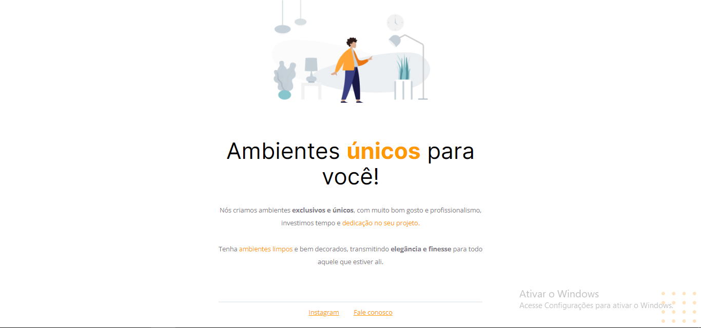

<h1 align="center">Resolução do desafio fase 01 da formação <a href="https://rocketseat.com/explorer">Explorer da Rocketseat</a>.</h1>

<h2 align="center">O desafio consistia corrigir o código bagunçado da página para que ficasse de acordo com o projeto do <a href="https://www.figma.com/design/fAvYZz4dPV5MfhL77XkqkD/Explorer---Projeto-01?node-id=1-2&t=SdBAT5S6VqwgFvzJ-0">figma</a></h2>
<h3>Antes</h3>

<h3>Depois</h3>

<h4>💻Tecnologias</h4>
<ul>
  <li>HTML</li>
  <li>CSS</li>
</ul>
